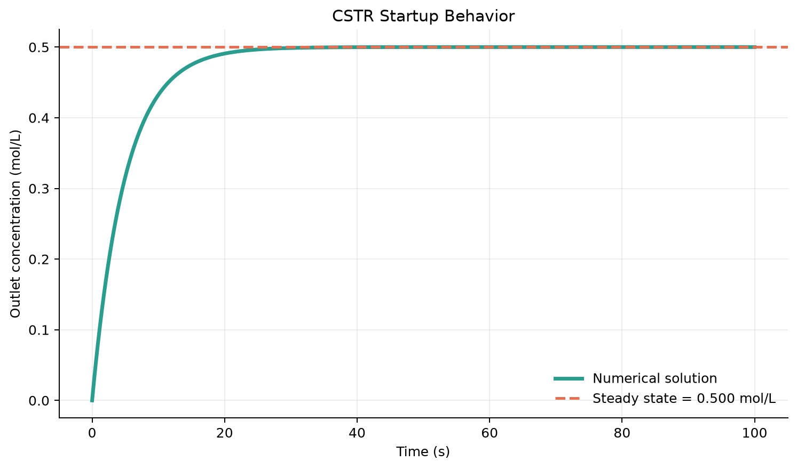

# CSTR Startup Simulation

An engineering simulation of the startup behavior of a continuous stirred-tank reactor with a first-order reaction.

## Model

The dynamic material balance is

```text
dC/dt = (Cin - C)/tau - kC
```

using:

- Rate constant `k = 0.1 s^-1`
- Residence time `tau = 10 s`
- Inlet concentration `Cin = 1.0 mol/L`
- Initial reactor concentration `C(0) = 0`

The numerical solution approaches a steady-state outlet concentration of **0.500 mol/L**, with a characteristic time constant of **5.00 s**.



## Run

```bash
pip install -r requirements.txt
python project_4_cstr.py
```

The program writes the graph and its CSV dataset under `results/project_4_cstr/`.
